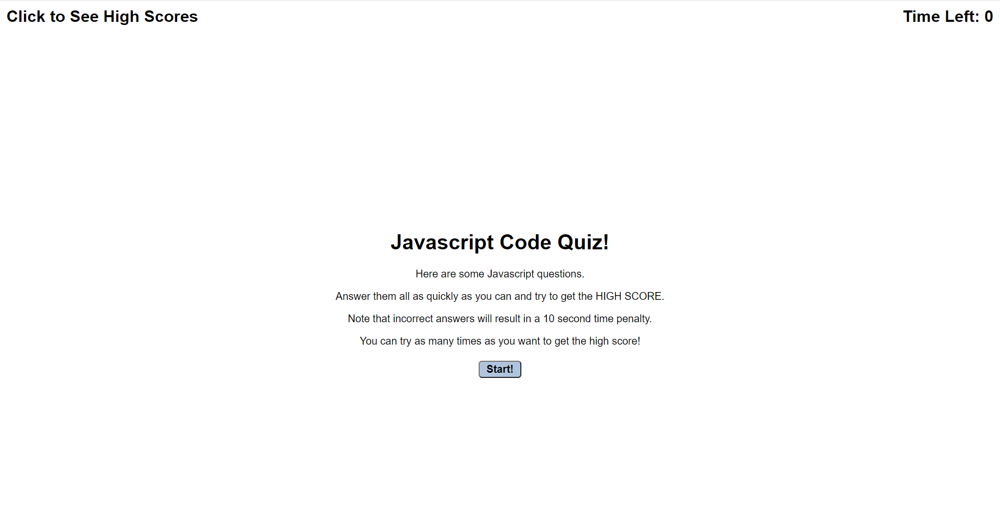
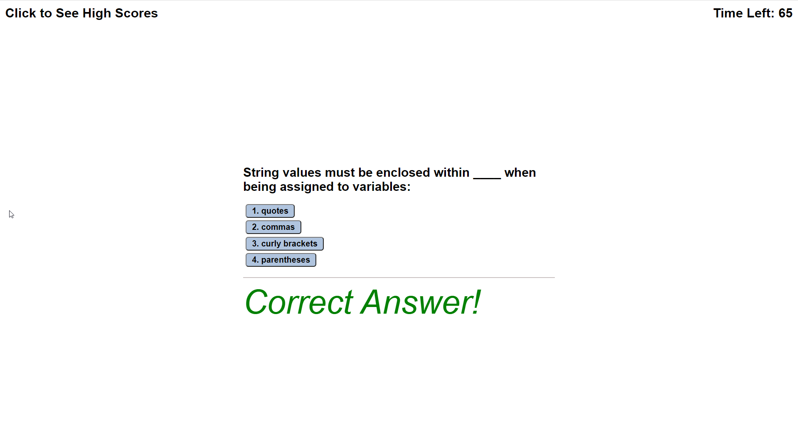
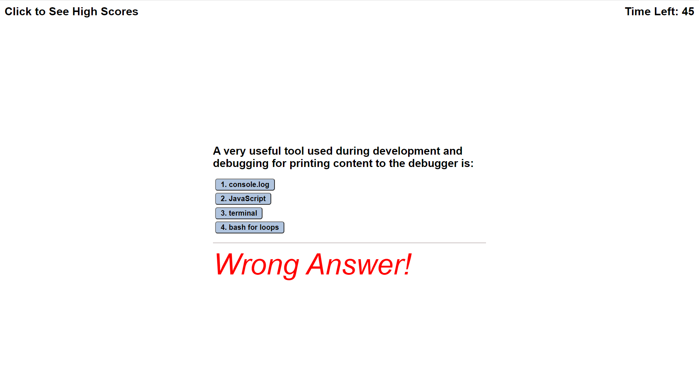
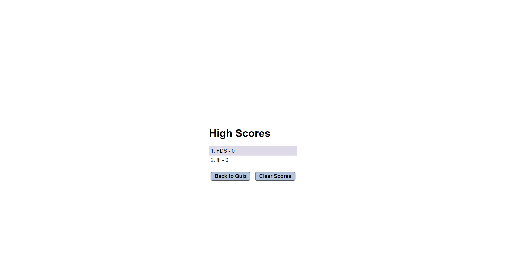

# 04 Web APIs: Code Quiz

## User Story

```
AS A coding boot camp student
I WANT to take a timed quiz on JavaScript fundamentals that stores high scores
SO THAT I can gauge my progress compared to my peers
```

## Acceptance Criteria

```
GIVEN I am taking a code quiz
WHEN I click the start button
THEN a timer starts and I am presented with a question
WHEN I answer a question
THEN I am presented with another question
WHEN I answer a question incorrectly
THEN time is subtracted from the clock
WHEN all questions are answered or the timer reaches 0
THEN the game is over
WHEN the game is over
THEN I can save my initials and my score
```

## Mock-Up

A user clicks through an interactive coding quiz, then enters initials to save the high score before resetting and starting over.

This shows the quiz start.



This shows how the quiz reacts to a correct answers.



This shows how the quiz reacts to a wrong answers.



There is a seperate page for high scores.



This layout is designed for desktop viewing, but optimized for mobile. 

URL: https://ckishel.github.io/homework4_web_api_code_quiz/